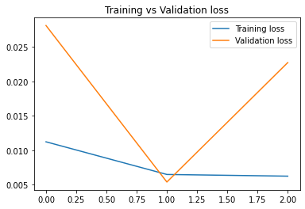
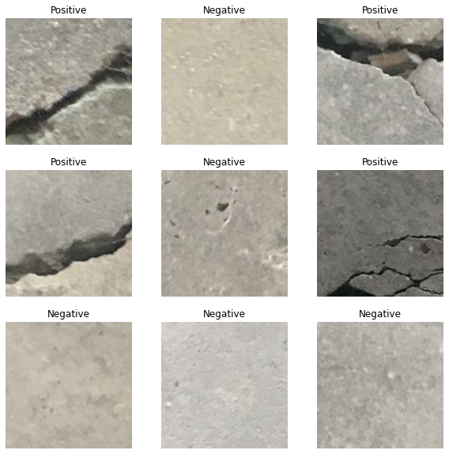

# Identifying Concrete Cracks with Image Classification using Neural Network
## 1. Summary
The aim of the project is identify cracks on concrete images using convolutional neural network. This project is a computer vision task where it is a binary classification problem. The model is trained with a dataset of 400000 images where 200000 images is divided equally between positive (cracks) and negative (no cracks) classes. The source of the dataset can be found https://data.mendeley.com/datasets/5y9wdsg2zt/2
## 2. IDE and Framework
This project is completed mainly using Spyder IDE. The main frameworks used in this project are Numpy, Matplotlib and TensorFlow Keras.
## 3. Methodology
The methodology for this project is inspired by a documentation on the official TensorFlow website. The documentation can be refer https://www.tensorflow.org/tutorials/images/transfer_learning
### 3.1 Model Pipeline
The input layer of the model is designed to receive coloured images with dimension of (180,180,3). Data augmentation layers is used ont the input images with random rotation and random flip.

Transfer learning approach is used in this project. Preprocessing layer is created to transform the images so that the pixel values is standardised to range between -1 and 1. This layer acts as a feature scaler of the input images.

For feature extractor, a pretrained model of ResNet50 is used. The model is readily available within TensorFlow package, with ImageNet pretrained parameters.

A global average pooling and dense layer are used as the classifier to output softmax activation function. The sofmax are used to predict the class of the input images.

The simplified illustration of the model is shown in the figure below.

The model is trained with a batch size of 32 and 20 epochs. Early stoping are applied on the training process of the model to avoid model overfitting issue. The training stops after 3 epochs and model reaches 99% training accuracy and 99% validation accuracy. The training results are shown in the figures below.

## 4. Results
The model is evaluated with test data. The loss and accuracy are shown in figure below.

Some predictions are also been made with the model are shown in the figure below.

